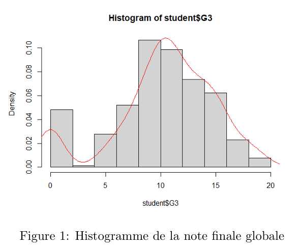
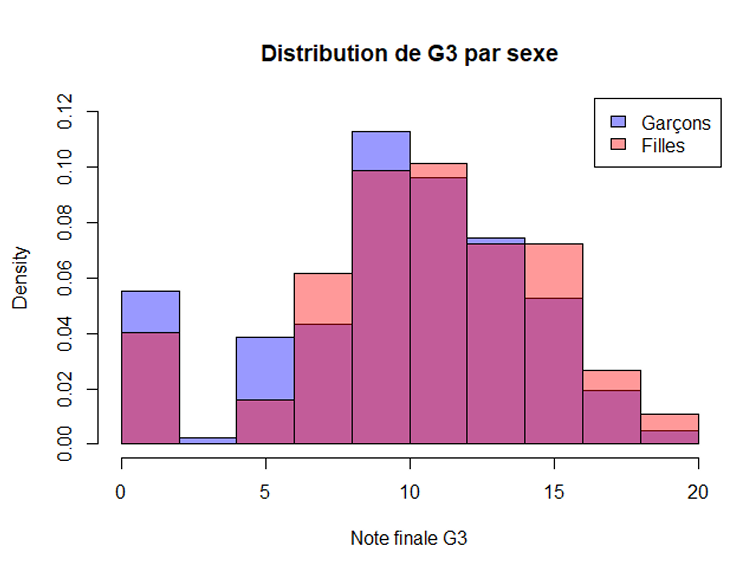
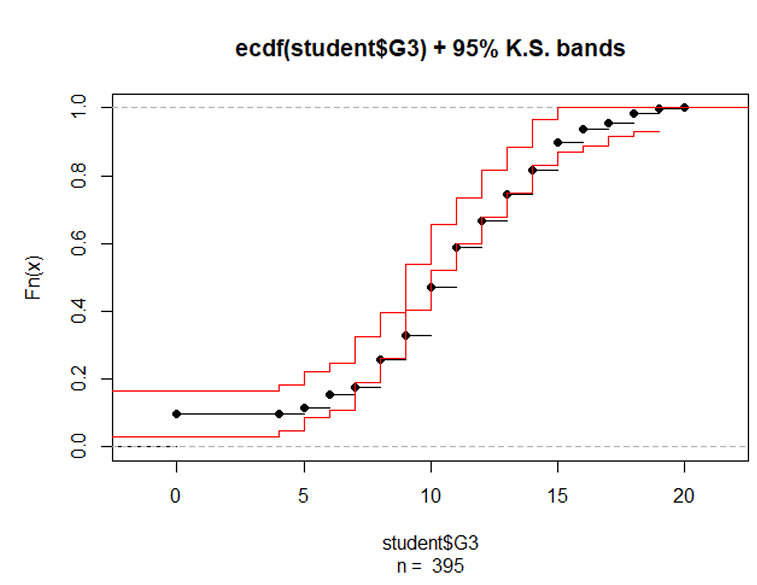

# Nonparametric Analysis of Student Performance

A statistical analysis of the **Student Performance** dataset using **nonparametric statistical methods** in R.

**Author:** Mateus Auza Cruz

---

## Overview

This project investigates the academic performance of Portuguese secondary school students using **nonparametric statistical methods**.

Because the data violate the assumptions required by classical parametric methods (mainly normality), the analysis relies on robust rank-based statistical procedures.

The study examines the influence of variables such as:

- Sex
- Weekly study time
- Previous failures
- Health status
- School absences
- Internet access

on students' final mathematics grades.

---

## Repository Structure

```text
.
├── code/
│   └── analysis.R
├── data/
│   └── student_data.csv
├── figures/
│   ├── ecdf.png
│   ├── grade-distribution.png
│   └── grades-by-sex.png
├── report/
│   └── nonparametric-analysis.pdf
├── LICENSE
└── README.md
```

---

## Dataset

The analysis uses the **Student Performance Data** dataset available on Kaggle:

https://www.kaggle.com/datasets/devansodariya/student-performance-data

The original dataset was collected from Portuguese secondary school students and contains demographic, educational and academic information.

### Variables Used

| Variable | Description |
|----------|-------------|
| sex | Student sex |
| age | Student age |
| studytime | Weekly study time (1–4) |
| internet | Internet access at home |
| health | Current health status (1–5) |
| failures | Previous academic failures |
| absences | Number of absences |
| G1 | First period grade |
| G2 | Second period grade |
| G3 | Final grade |

---

## Statistical Methods

The project implements several nonparametric techniques, including:

- Descriptive statistics
- Histograms
- Empirical Cumulative Distribution Function (ECDF)
- Dvoretzky–Kiefer–Wolfowitz confidence bands
- Shapiro–Wilk normality tests
- Mira symmetry tests
- Sign test
- Wilcoxon signed-rank test
- Mann–Whitney test
- Fisher's Exact Test
- Kruskal–Wallis test
- Dunn post-hoc comparisons
- Friedman test
- Mood test
- Siegel–Tukey dispersion test
- Sukhatme dispersion test
- Chi-square goodness-of-fit test
- Kolmogorov–Smirnov goodness-of-fit test
- Kendall's Tau
- Spearman's Rho
- Chi-square independence test
- Cramér's V
- Pearson contingency coefficient

---

## R Packages

```r
library(sfsmisc)
library(symmetry)
library(rstatix)
library(FSA)
library(DescTools)
library(dgof)
```

---

## Running the Analysis

Clone the repository

```bash
git clone https://github.com/Mateus-Auza/nonparametric-analysis.git
cd nonparametric-analysis
```

Run the analysis

```r
source("code/analysis.R")
```

The script expects the dataset to be located in

```text
data/student_data.csv
```

---

# Results Preview

### Distribution of Final Grades



---

### Final Grades by Sex



---

### Empirical Cumulative Distribution Function



---

## Main Findings

- Final grades are **not normally distributed**, justifying the use of nonparametric methods.
- Previous academic failures have a strong negative impact on final grades.
- Weekly study time shows a marginal influence on academic performance.
- Boys obtain slightly higher final grades than girls according to the Mann–Whitney test.
- No significant difference in grade dispersion exists between sexes.
- Health ratings are not uniformly distributed.
- Internet access is not significantly associated with study time.
- Absences and previous failures exhibit only a weak positive association.

Overall, the study illustrates the robustness and effectiveness of nonparametric statistical methods for analyzing discrete and non-Gaussian educational data.

---

## Report

The complete report is available in

```
report/nonparametric-analysis.pdf
```

---

## References

- Cortez, P., & Silva, A. (2008). *Using Data Mining to Predict Secondary School Student Performance.*
- Pircalabelu, E. (2025–2026). *Statistique Non Paramétrique: méthodes de base*. UCLouvain.
- Maechler, M. **sfsmisc** R package.
- Ivanović, B., & Obradović, M. **symmetry** R package.
- Kassambara, A. **rstatix** R package.
- Ogle, D. H., Wheeler, P., & Dinno, A. **FSA** R package.
- Arnold, T. B., & Emerson, J. W. **dgof** R package.

---

## License

This project is distributed under the terms of the LICENSE file included in this repository.
